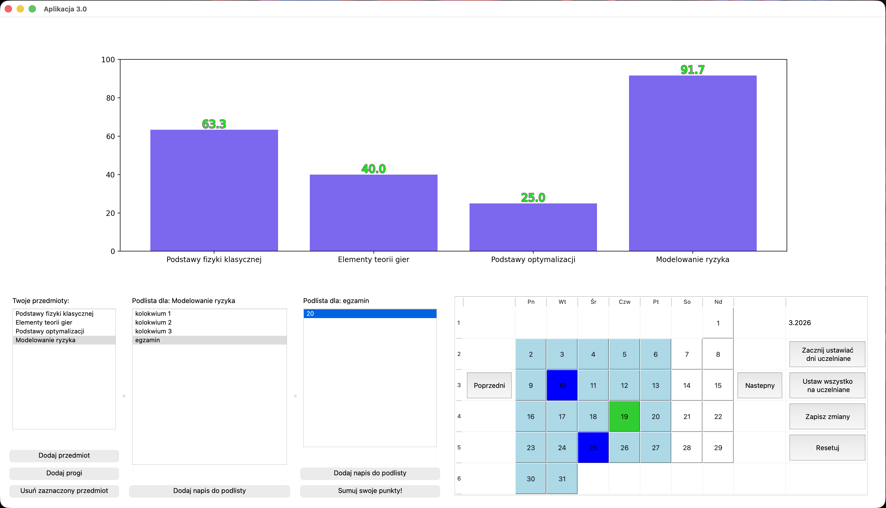

# 3.0
Aplikacja "3.0" przygotowana na kurs "Programowanie" w zespole pięcioosobowym.

## Opis projektu:

Kompleksowa aplikacja desktopowa wspomagająca śledzenie wyników w nauce. Narzędzie pozwala studentom na bieżąco monitorować postępy w nauce poprzez zestawianie zdobytych punktów z progami ocen, oferując natychmiastową wizualizację danych.

### Kluczowe Funkcjonalności:

- System Zarządzania Przedmiotami: Możliwość definiowania własnych kursów oraz przypisanych do nich zasad oceniania
- Dynamiczne Przeliczanie Progresu: Silnik aplikacji automatycznie oblicza procentowy postęp względem ustalonych progów na konkretne oceny
- Wizualizacja Statystyczna: Zintegrowany moduł wykresów (Matplotlib) generujący słupkowe zestawienie postępów dla wszystkich przedmiotów na jednym ekranie
- Interaktywny Terminarz: Kalendarz umożliwiający planowanie kolokwiów, egzaminów i oznaczenie dni wolnych

### Wykorzystany Stack Technologiczny:

- Język: Python 3
- GUI Framework: PyQt5 
- Data Viz: Matplotlib 
- Operacje na Datach: python-dateutil do obsługi logiki kalendarza.

### Podgląd Interfejsu:

